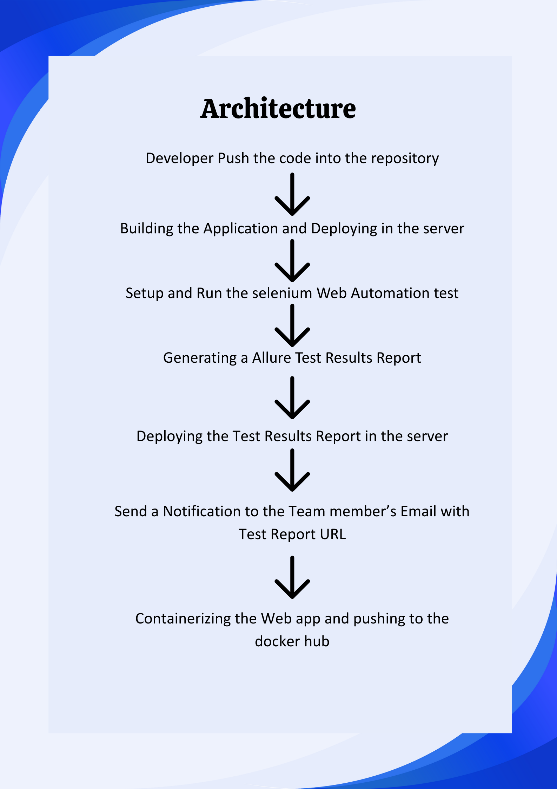
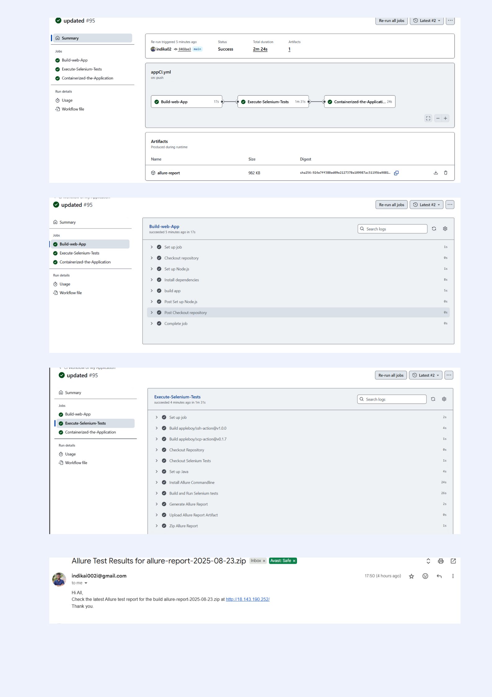

# 🚀 CI/CD Workflow for Student Management System Application

This repository demonstrates a **GitHub Actions-based CI/CD pipeline** that automates:

1. **Build Web Application**  
2. **Run Selenium Automation Tests**  
3. **Generate and Deploy Allure Reports**  
4. **Send Email Notifications**  
5. **Containerize the App with Docker**

---

## 📌 Workflow Overview

The workflow (`.github/workflows/ci.yml`) runs automatically on pushes to the **main** branch.

### 🔹 Job 1: Build Web Application
- Checkout repository  
- Setup **Node.js v20**  
- Install dependencies & build the app  

### 🔹 Job 2: Execute Selenium Tests
- Checkout Selenium tests repo (`studentautomation`)  
- Setup **Java (Temurin 24)**  
- Install **Allure CLI**  
- Run Selenium tests with Maven  
- Generate and upload Allure Report  
- Deploy report to **Nginx on AWS EC2**  
- Archive old reports for history  
- Send email notification with report link  

### 🔹 Job 3: Containerize the Application
- Login to Docker Hub  
- Build and push Docker image  

---

## 🛠️ Tools & Technologies
- **GitHub Actions** – CI/CD automation  
- **Node.js** – Web app build  
- **Java + Maven** – Selenium test execution  
- **Selenium** – Automation testing  
- **Allure** – Test reporting  
- **AWS EC2 + Nginx** – Report hosting  
- **Docker** – Containerization  
- **SMTP (Gmail)** – Email notifications  

---

## 🔑 Repository Secrets

Before running the workflow, configure these secrets in your repository settings:

| Secret Name       | Description |
|-------------------|-------------|
| `TEST_HOST`       | EC2 public IP or hostname |
| `TEST_USER`       | SSH username |
| `TEST_SSHKEY`     | SSH private key |
| `EMAIL`           | Email address (SMTP) |
| `PASSWORD`        | SMTP app password |
| `DOCKER_USERNAME` | Docker Hub username |
| `DOCKER_PASSWORD` | Docker Hub password or token |

---

## 📊 Report Access

Allure Test Report will be hosted at:  
👉 `http://<EC2-PUBLIC-IP>/`  

Example:  
`http://18.143.190.252/`

---

## 📬 Email Notification

Each pipeline run sends an email with:
- **Allure Report link**   

---

## 📦 Docker Image

The final application image is published to Docker Hub:  

docker pull <DOCKER_USERNAME>/sms:latest
docker run -p 3000:3000 <DOCKER_USERNAME>/sms:latest

---

## 📂 Project Structure

```plaintext
├── .github/
│   └── workflows/
│       └── ci.yml        # CI/CD pipeline definition
├── src/                  # Application source code
├── selenium-tests/       # Test automation repo (cloned in workflow)
├── Dockerfile            # Docker build file
├── package.json          # Node.js dependencies
└── README.md             # Project documentation

---
```
## 📊 CI/CD Workflow Diagram



